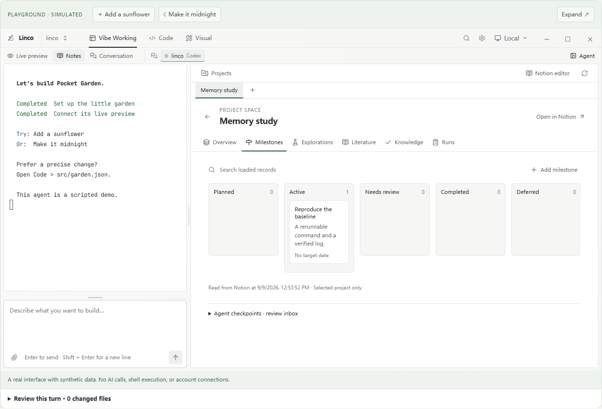
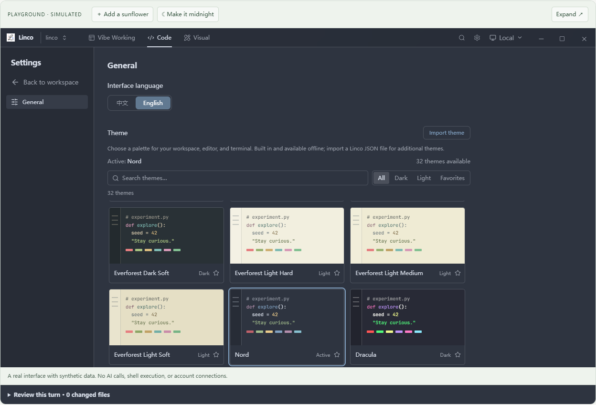
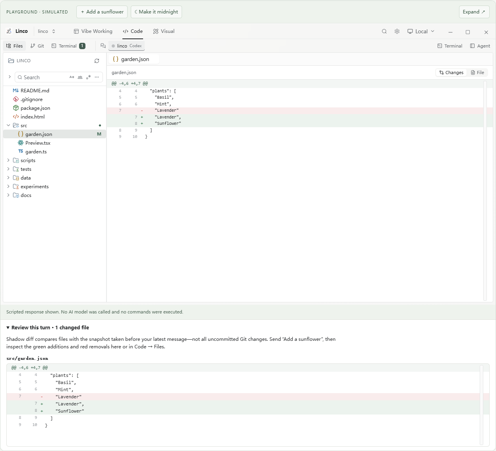

<div align="center">

# Linco

### Keep the vibe. Keep the whole picture.

An open-source desktop workspace for **vibe coding**.<br />Your AI agent, code, live preview and project decisions—in one place.

[Download for Windows & Mac](https://github.com/Peilin-FF/linco/releases/latest) · [Play with the demo](https://peilin-ff.github.io/linco/) · [Get started](docs/GETTING_STARTED.md) · [中文](README.zh-CN.md)

[](https://github.com/Peilin-FF/linco/releases/latest)
[](LICENSE)

[](https://peilin-ff.github.io/linco/)

*Real Linco components. A synthetic project you can play with. No signup or AI credits.*

</div>

You have an idea. Your agent starts building. Soon the conversation is in one window, the preview in another, the logs somewhere else—and yesterday's decisions are hard to find.

**Linco brings the work back together.** Describe a change, see the result, inspect the code, and keep the context you will need for the next iteration.

## Try a little project before installing

Open the [interactive playground](https://peilin-ff.github.io/linco/) and grow a **Pocket Garden**:

1. Water a plant until it blooms.
2. Ask the scripted demo agent to **“Add a sunflower”** or **“Make it midnight.”**
3. Open **Code → Files → src/garden.json**, edit the title, and save. Return to the preview to see your change.
4. Explore sample logs, research projects, milestones and the theme gallery.
5. Expand **Review this turn** to see the shadow diff: red/green changes since your latest message. Sending another message resets that comparison, while Git retains all demo edits.

The demo uses the desktop's actual interface with a simulated backend. It does **not** call an AI model, execute shell commands, connect over SSH, or access Notion. Demo edits stay in memory until reload. The downloadable app connects to your real tools after setup.

## The loop, not just the chat

| Workspace | What you do | Why it matters |
| --- | --- | --- |
| **Vibe Working** | Keep your coding agent beside the live preview, notes or conversation. | Iterate on the result without losing the conversation. |
| **Code** | Browse files, edit syntax-highlighted code, review Git changes, and open terminals. | Stay in control of the actual implementation. |
| **Visual** | Sketch ideas and work with LaTeX documents. | Think beyond a stream of messages. |
| **Project memory** | Organize explorations, milestones, literature, runs and conclusions in Notion-backed research spaces. | Return with useful context, not just a long chat transcript. |

### What makes Linco worth trying

- **Your agent, your workflow.** Drive configured CLI agents such as Codex and Claude Code. Linco is the workspace around them, not a new model subscription.
- **See the product while you build it.** Live preview stays beside the agent; switch to the source when you want a precise change.
- **Real tools stay within reach.** Use files, Git and embedded terminals on local projects or SSH workspaces.
- **Sessions are first-class.** Open sessions stay visible in Vibe Working and Code; historical conversations remain available in Projects.
- **Make noisy output readable.** ANSI colors, semantic log highlights, filters, raw output and compact monospace text help you find important lines.
- **Keep evidence with the idea.** Research spaces separate projects, explorations and conclusions. Prepare an agent briefing from selected records instead of forwarding everything blindly.
- **A workspace that feels like yours.** Choose from 32 built-in themes, favorite a few, or import a data-only palette. Editor, terminal and chrome follow the theme together.

## Four ways to put it to work

<details>
<summary>See project memory and the theme gallery</summary>







</details>

### “I want to launch a small website.”

Ask your agent to build a plant-shop landing page. Refine the layout beside the preview. Open the source for a precise change, run checks in the terminal, and review the Git diff before committing.

### “This bug only happens when I switch tabs.”

Keep the conversation next to the files while the agent investigates. Ask for a regression test, run it, inspect the output, and review the patch. You can verify the result without handing over all judgment to the model.

### “My experiment runs on another machine.”

Open the SSH workspace, inspect the script, and follow the task log. Filter warnings and metrics, then record the result and its limits in the project's research space.

### “What did we learn last week?”

Open the project's milestones and explorations. Select relevant records, review the generated briefing, and continue with an agent. Useful memory comes from saved evidence and reviewed conclusions—not a promise that AI remembers everything automatically.

*These are illustrative workflows, not customer testimonials or guaranteed model outcomes.*

## Start building

1. **[Download the latest release](https://github.com/Peilin-FF/linco/releases/latest)** for Windows x64, Apple Silicon, or Intel Mac.
2. **Install and authorize a supported coding CLI.** Use your own provider credentials or subscription; model usage is separate from Linco.
3. **Open a local project or configure SSH**, choose your agent, and start in Vibe Working.
4. **Connect Notion if you want structured project memory.** Native page editing and agent-facing Notion tools require the desktop and the relevant authorization.

Mac builds are ad-hoc signed, not Apple-notarized, so macOS may show a first-launch security warning. Build checks do not replace testing your particular Mac setup.

See [Getting started](docs/GETTING_STARTED.md) for prerequisites, boundaries and the development setup.

## What's in this repository?

| Path | Purpose |
| --- | --- |
| `src/` + `src-tauri/` | React + Rust desktop app for Windows and macOS |
| `demo/` | Public playground, sample data and a separate website build; never bundled into the desktop |
| `tests/` | Unit and browser regressions, including shared simulated-workspace checks |
| `ios/` | Separate native iPhone client |
| `apps/linco-server/` + `crates/` | Linux server, protocol and runtime for the iPhone client |
| `third-party/` | Required notices and licenses for bundled resources |

The iPhone client uses its own HTTPS/WSS server setup—not the desktop's SSH connection. See [iPhone build instructions](ios/README.md), [server deployment](docs/DEPLOYMENT.md), and the [native architecture notes](docs/native-architecture.md).

## Build or contribute

```sh
npm ci
npm run tauri:dev  # Needs Rust and the platform's Tauri prerequisites
```

Browser playground only:

```sh
npm run demo:dev   # http://127.0.0.1:1432
npm run demo:build
```

Checks: `npm test`, `npm run build`, and `npm run test:browser` (the browser suite uses Microsoft Edge).

[Report a bug](https://github.com/Peilin-FF/linco/issues) · [Suggest a workflow](https://github.com/Peilin-FF/linco/issues/new) · [Release notes](https://github.com/Peilin-FF/linco/releases)

Linco is open source under the [repository license](LICENSE). Third-party themes and resources retain their own licenses. No affiliation with agent or theme vendors is implied.
