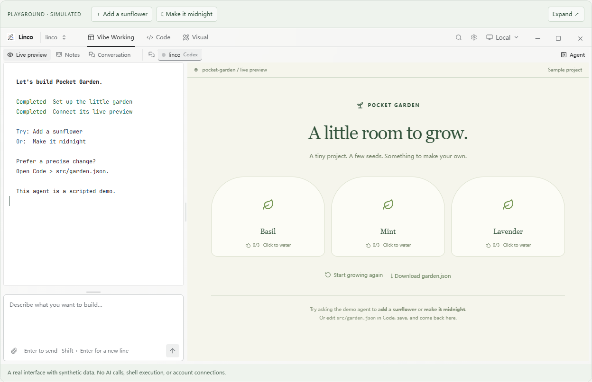

# Linco

### 保持创作的心流，也看清项目的全貌。

面向 **Vibe Coding / AI 辅助开发** 的开源桌面工作台：把编程 Agent、代码、实时预览、终端和项目记录放在一起。

[下载 Windows / Mac 版](https://github.com/Peilin-FF/linco/releases/latest) · [试玩交互 Demo](demo/README.md) · [English](README.md)

[](demo/README.md)

## 不只是聊天，而是完整的迭代过程

- **Vibe Working**：一边和编程 Agent 协作，一边查看预览、笔记或对话。
- **Code**：浏览和编辑文件、阅读语法高亮、检查 Git 改动，在文件旁打开终端。
- **Visual**：画布与 LaTeX 工作区，帮助你用文字之外的形式思考。
- **项目记忆**：用 Notion 研究空间组织项目、里程碑、探索、文献、实验和结论，选择记录后整理给 Agent 的上下文。
- **本地与远程**：打开本地项目，或通过 SSH 操作远程工作区。
- **更易读的输出**：ANSI 颜色、日志重点高亮、过滤和原始输出模式。
- **自己的工作氛围**：32 款内置主题，支持收藏与导入配色；编辑器、终端和界面保持一致。

## 先种一个小花园

浏览器 Demo 使用真实桌面组件和模拟数据。给植物浇水，向演示 Agent 输入 “Add a sunflower” 或 “Make it midnight”，也可以在 Code 中修改 `src/garden.json`，保存后回到预览查看变化。

**演示不调用真实模型，不执行命令，不连接 SSH 或 Notion。** Agent 回复是预设脚本，文件修改只保留到刷新页面；部分主题偏好保存在当前浏览器。

## 你可以怎样用它？

1. **做一个小网站**：描述想法 → 看预览 → 精确修改代码 → 跑检查 → 审阅 Git 改动。
2. **修一个难复现的 Bug**：让 Agent 调查 → 添加回归测试 → 在终端确认结果 → 审查补丁。
3. **跑远程实验**：打开 SSH 工作区 → 检查脚本和日志 → 记录结果、局限与下一步。
4. **接着上周的项目做**：回顾探索与里程碑 → 选择证据 → 审阅 Agent 简报 → 继续工作。

以上是使用场景，不是客户评价或模型效果承诺。可靠的项目记忆仍然需要主动记录和审阅。

## 安装与开发

下载 Windows x64、Apple Silicon 或 Intel Mac 安装包。安装并授权你的编程 CLI（例如 Codex 或 Claude Code），打开项目后选择 Agent。模型费用或订阅由对应服务商提供，Linco 不包含模型额度。

Notion 原生编辑与相关工具需要桌面应用及授权。当前 Mac 版本采用 ad-hoc 签名，尚未 Apple 公证，首次启动可能有系统安全提示。

```sh
npm ci
npm run tauri:dev  # 需要 Rust 与对应平台的 Tauri 开发依赖
npm run demo:dev   # 仅浏览器试玩，http://127.0.0.1:1432
```

仓库也包含独立的 [iPhone 客户端](ios/README.md) 和 [Linux 服务端](docs/DEPLOYMENT.md)。它们使用 HTTPS/WSS，和桌面 SSH 工作流不同。

[使用说明](docs/GETTING_STARTED.md) · [反馈问题](https://github.com/Peilin-FF/linco/issues) · [开源许可证](LICENSE)
