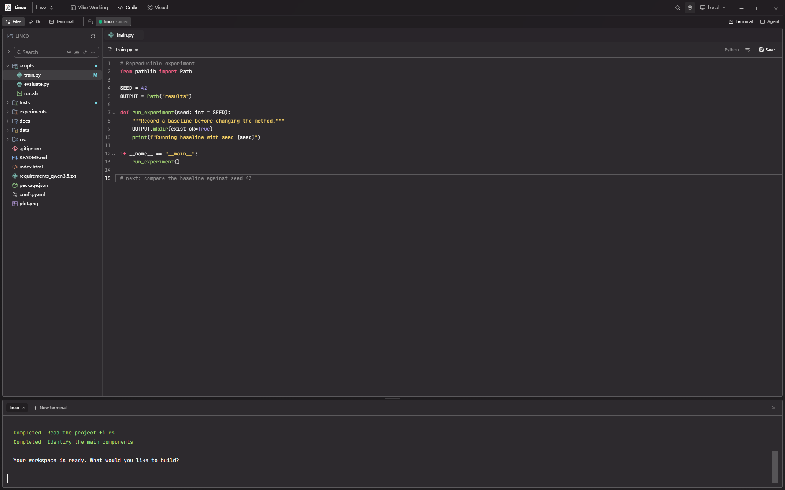

# Monokai Pro (CE) for [Linco](https://github.com/Peilin-FF/linco)

The screenshot uses a sample project; it does not represent real experiment results.

## About this theme

This Monokai Pro Community Edition (CE) theme is maintained by the
[Linco contributors](https://github.com/Peilin-FF/linco) and is based on the original
[Monokai Pro](https://monokai.pro) theme.

[Installation instructions](INSTALL.md)

[MIT License](LICENSE.md)

## Status and scope

Source-only Community Edition candidate, prepared from the official
[Community Edition template](https://github.com/monokai-pro/community-edition).
It has not been submitted, accepted, or endorsed by Monokai. No public package URL
exists yet. The candidate is included in Linco's source repository, but is not
bundled in the app or released as a standalone theme package.

Only the default Monokai Pro filter is included. This is a data-only Linco theme,
covering the workbench, code syntax, ANSI terminal palette and log highlights.
No proprietary extension code, font files or file-icon pack is included.
Comments use the palette's second dimmed foreground for readability; button and
selection roles use the default palette's neutral shades. These are Linco-specific
role mappings, not extra color filters.

The package is to remain free, non-commercial and open source. Its maintainers
agree to Monokai's right to potentially take over this theme package, as required
by the [Community Edition conditions](https://monokai.pro/contribute). This applies
to this theme package, not ownership of the Linco application.

## Local verification

Run `npm test` or `node verify.mjs` in this directory. No dependencies or build step
are required. Linco's integration tests additionally exercise importing, switching,
persistence, rejection of invalid files and preserving editor/terminal state.

## Publication checklist

1. Review the package and Community Edition conditions.
2. Create the separate theme repository from the official GitHub template and
   place this package's files at its root. Keep the upstream license and credits.
3. Confirm `screenshot.png` is an app-only image at least 2048 pixels wide and
   `icon.png` is the centered, padded Linco app icon at least 1024 pixels wide.
4. Publish the free, non-commercial source package; update this status and install
   instructions with its actual repository URL.
5. Submit its repository link using the issue workflow in `CONTRIBUTING.md`.
   Do not describe it as accepted or official before review.

No publication, submission, purchase, or account change is performed by the package.

## Monokai Pro for more apps

[Monokai Pro](https://monokai.pro)
